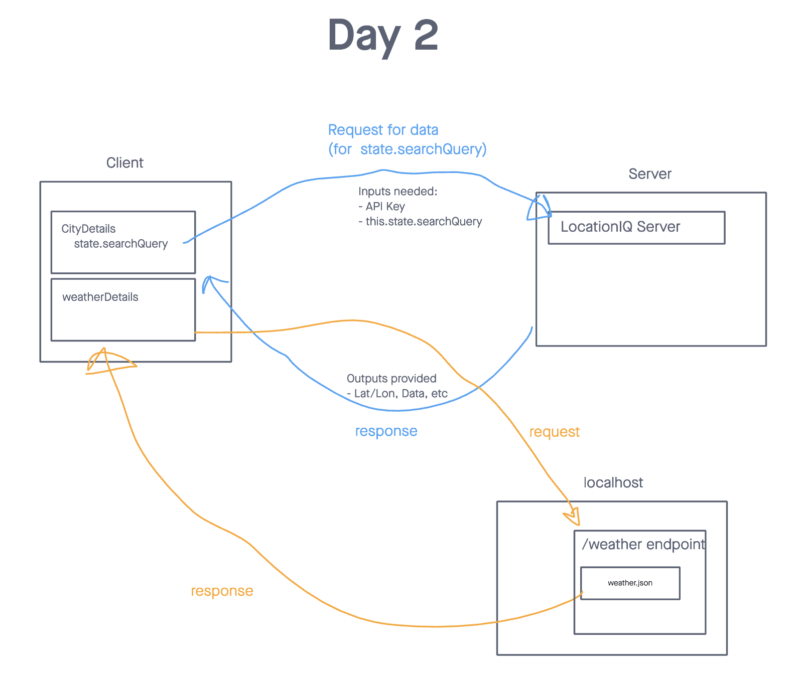

# City Explorer API

**Author**: Paul Brown
**Version**: 1.0.0 (increment the patch/fix version number if you make more commits past your first submission)

## Overview
API Server for my City Explorer app

## Getting Started
- Create a new repo called `city-explorer-api` on GitHub, initialized with a README file. Clone it locally, and do all your work on a meaningfully-named feature branch off of `main`.
- Run the command `npm init` to create a new project. Answer the prompts with reasonable answers, or just hit enter to accept the defaults. Review the `package.json` file that it creates for you, and edit it if desired.
- Use `npm install` to add the required dependencies to this project: `express`, `dotenv`, and `cors`.
- Manually add the remaining files identified in the folder tree above. Put appropriate content into `.gitignore` and `.eslintrc.json`.
- Copy the contents of [weather.json](https://codefellows.github.io/code-301-guide/curriculum/class-07/lab/starter-code/data/weather.json) and paste it into your (otherwise empty) local `/data/weather.json`. 
- Set the contents of .env to set a value for `PORT`. Ensure `.env` is in your `.gitignore` file.

## Architecture
<!-- Provide a detailed description of the application design. What technologies (languages, libraries, etc) you're using, and any other relevant design information. -->

## Change Log
<!-- Use this area to document the iterative changes made to your application as each feature is successfully implemented. Use time stamps. Here's an example:

01-01-2001 4:59pm - Application now has a fully-functional express server, with a GET route for the location resource. -->

## Credit and Collaborations

All the AI's out there 👊